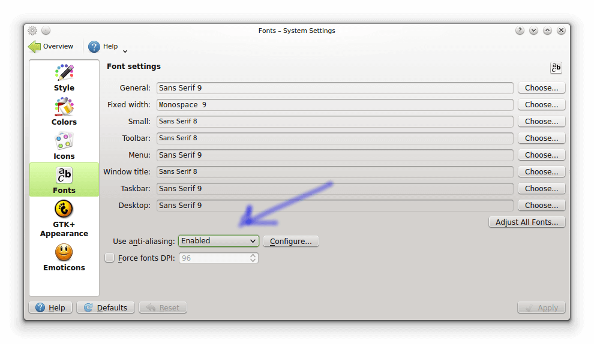
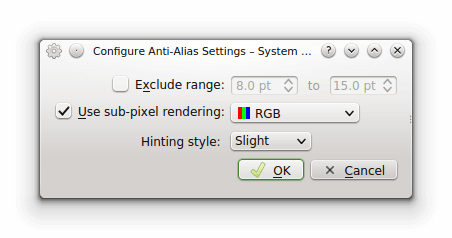

Title: Fontes de texto serrilhadas no KDE
Date: 2014-06-03T10:15:00-07:00
Category: Tutorial
Tags: KDE, Tutorial, Linux Mint
Author: Michell Stuttgart
Summary: Minha solução para o bug do Linux Mint KDE que ocorre após a instalação de alguns tipos de temas, deixando as fontes de todo o KDE mais finas e serrilhadas.

Eu tenho o KDE como meu ambiente gráfico favorito. Além de ser visualmente atraente, altamente configurável e muito fácil de usar. Mas como nem tudo é perfeito, nós as vezes encontramos alguns bugs chatos pra resolver. O bug em questão acontece após a instalação de alguns tipos de temas, deixando as fontes de todo o KDE mais finas e serrilhadas. Apesar disso ocorrer muito raramente, quando
acontece, as fontes não voltam ao normal mesmo que as configurações de alti-aliased das delas sejam alteradas. Eu já presenciei esse erro no KDE 4.9, 4.12 e 4.13 (o que uso atualmente). Depois de quebrar a cabeça com o bug eu finalmente consegui corrigi-lo e compartilho com vocês os passos a serem seguidos.
Inicialmente, vamos até o painel de configurações de fontes do KDE.

> System Settings -> Application appearance -> Fonts

Onde está escrito `"Use anti-aliasing"` selecione a opção `"Enable"`, como ilustra a figura a seguir.

Sem seguida, clique em `Configure..`. Uma janela com algumas opções vai abrir. Deixe as suas configurações iguais as mostradas na figura abaixo e depois clique em `OK`.

Terminada as configurações acima, clique no botão em `Apply` e feche a janela de configurações. Você pode perceber que mesmo configurando as fontes, elas ainda permanecem serrilhadas. Então, o próximo passo é ajustá-las manualmente.

Vá para a sua pasta `home/usuario` e procure o arquivo `.font.conf`. Os arquivos cujo nome se inicia com `"."` são arquivos ocultos do sistema. Caso o arquivo `.font.conf` não apareça pra você, aperte o atalho `Alt + .` . Feito isso, os arquivos devem ficar visíveis.

Procure o arquivo `.font.conf` e o abra em um editor de texto. Feito isso, substitua todos os `false` que encontrar no arquivo por `true` e reinicie o sistema. Quando você logar novamente, verá que as fontes voltaram ao normal e não estão mais serrilhadas. Essa configuração deve ser feita apenas quando ocorrer esse bug com a fontes do KDE.

É isso pessoal. Até o próximo post.
